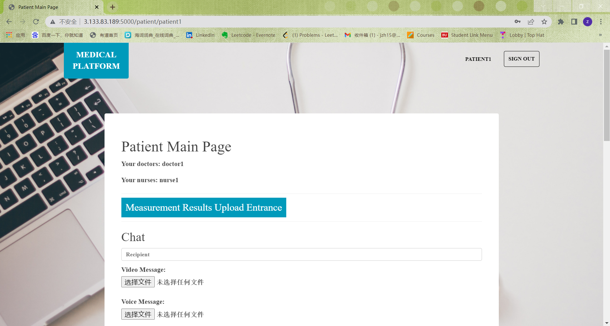
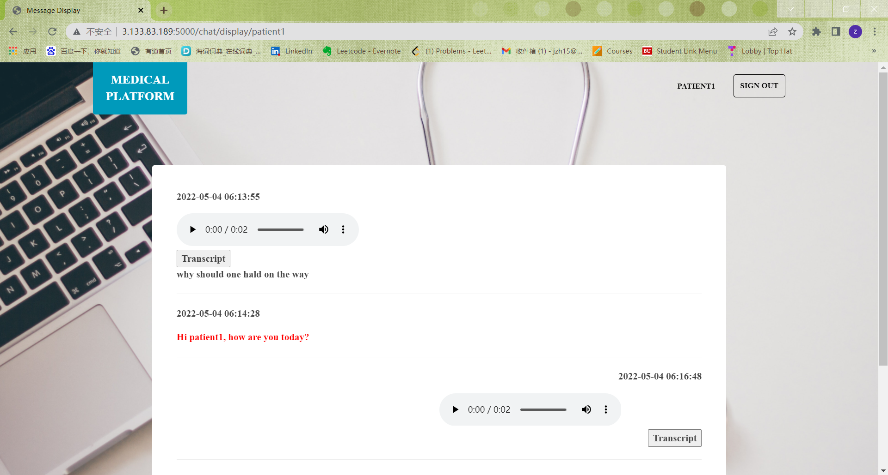
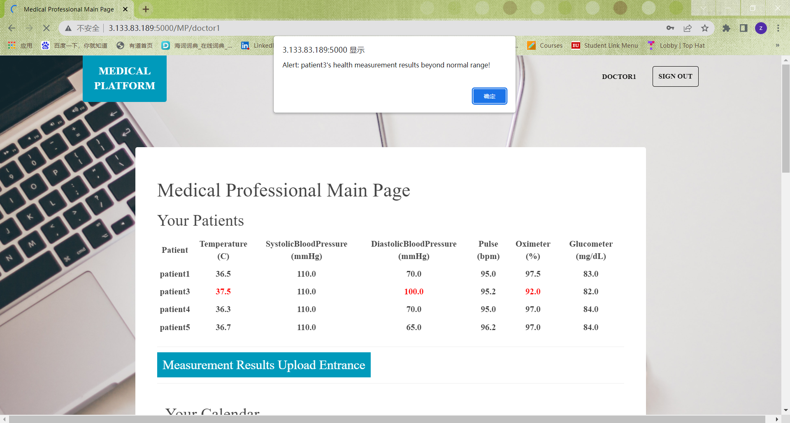
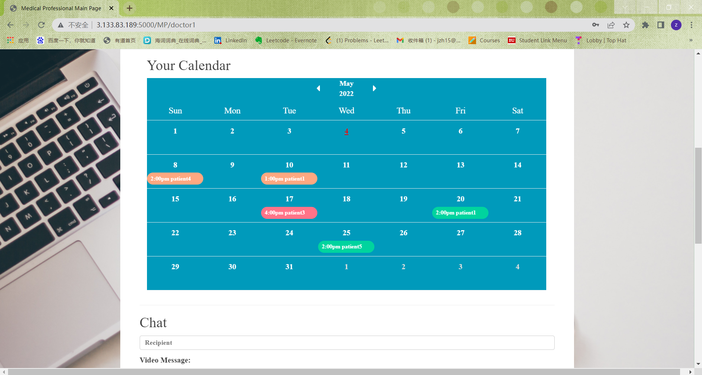
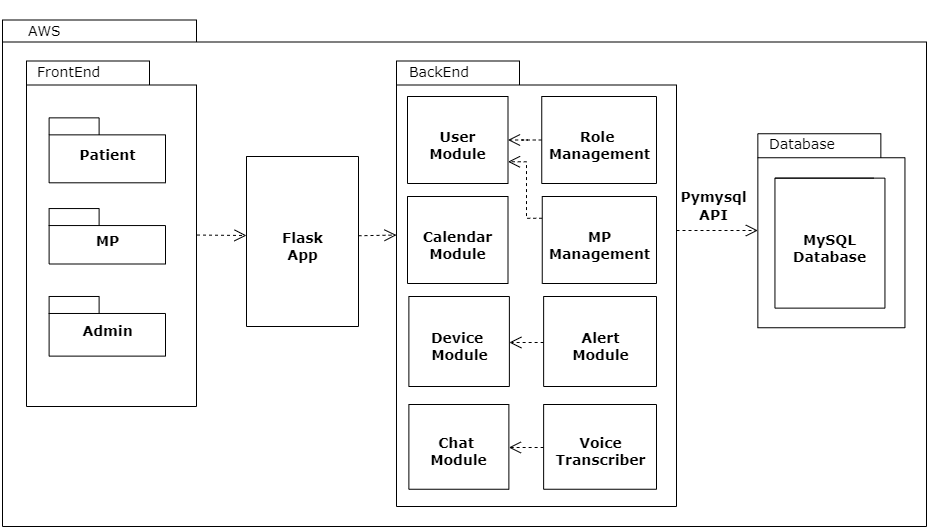
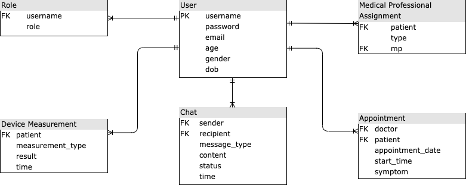

# Medical_Platform
Platform to monitor patients at home or in the hospitals 

## Branches
### Phase 0&1
All commits of phase 0 & 1 are in branch `Phase1` (now it's merged to `main` branch but not deleted).  
`Phase1` mainly achieves a device module, which uses json string of device measurement data as input and stores all data into a json file. In addition, this device module can handle error conditions, checking if measurement fields are missing and if measurement results are numbers and positive.

### Phase 2
All commits of phase 2 are in branch `Phase2` (now it's merged to `main` branch but not deleted).  
`Phase2` mainly achieves a restful system. Based on module in `Phase1`, it makes it restful which allows users to send device measurement results in json format. Then the restful system will parse the results in json format and pass into device module, checking fields and data errors and storing them in json file. The restful system is also deployed to AWS.

### Phase 3
All commits of phase 3 are in branch `Phase3` (now it's merged to `main` branch but not deleted).  
`Phase3` achieves chat module and corresponding restful api. In chat module it can send text/video/voice messages to other user. The text messages are directly stored in MySQL database while the addresses of video/voice files are stored in the database. A chat table is built for users (You can find its schema in [Database Schema](#database-schema)). As different users are needed in chat module, I also developed login/register functionality in restful api for the convenience of chat module testing. The user information and password are stored in user table.  

### Phase 4 (Project 5)
All commits of phase 4 are in branch `Phase4` (now it's merged to `main` branch but not deleted).  
`Phase4` builds a web application based on modules developed in previous phases. For our web application, it has a index page introducing the purpose of the website and linking to login/signup pages. The website application also contains a main page supporting device and chat functionality, which calls restful device and chat module at the back side. I also builds a display page for users to display history messages with others.  

### Phase 5 (Final Project)
This phase is completed together with teammate evezhang@bu.edu.  
All commits of phase 5 are in branches `Phase5` and `Phase5_eve` (now they're merged to the `main` branch but not deleted).  
In `Phase 5` we first develop administrator system to manage users' roles and assign MP to patients. In role management module, we set the role to None, Doctor, Nurse and Patient, so instead of only one main page in `Phase4`, we builds four different main pages for four different roles. Then we supports more functionalities based on `Phase 4` including Patient's appointing, Doctor's calendar showing appointments, voice transcriber and Patient's health measurement alert. The whole system is deployed on AWS EC2.  
The website url is [http://3.133.83.189:5000/](http://3.133.83.189:5000/) (Currently it's closed to avoid unnecessary charge. If you want to check it, please contact us at jzh15@bu.edu or evezhang@bu.edu)

## Website Display
### Pages before Login
#### Index Page
 

#### Login Page


#### Signup Page
Compared to original signup page, we ask user to enter more information like email, age, gender, dob besides username and password.


### Pages for New User
#### Main Page
If you are a new user without any role, you can only use chat functionality.

 

### Pages for Patient
#### Main Page
In patient main page, patient can enter their device measurement data, chat with txt/voice/video and make appointments with MP.  
Patient's doctor and nurse name will be shown on the very first line.  
To make main page more clear, I move device data entering to a seperate page, click `Measurement Results Upload Entrance` then you can go to that page.  

For chat part, the recipient you choose must be in our system. If you enter a random name, error will be reported.  
Note: Upload large video/voice file may take some time. Displaying history messages may also take some time to load our transcriber, please be patient.

For appointment part, note that you must follow the date entering format shown in placeholder. If you don't follow the format error will be reported. Each appointment is one hour fixed so we only set start time. Start time is a choosing box only providing options from 10:00:00 to 17:00:00, considering common work time.  
If you want to see your history appointments, you can click `Display History Appointments`

 


#### Device Page


#### History Message Page
Messages received will be displayed at the left side of the screen while messages sent will be displayed at the right side. Text messages will be shown in red.

There is a `Transcript` button below each voice message. Click it then transcript will be shown below the button.  
In image below I clicked the first one and you can find the effect.



#### History Appointment Page


### Pages for MP
#### Main Page
When medical professional (Doctor or Nurse) log in to their main page, if some patients' measurement data beyond the normal range, alerts will pop up. Only if they click `Confirm` then they can operate on the main page. There is only one alert for one patient, even if his multiple data beyond range, i.e. we don't set alert for each specific measurement item (We don't want the alerts to be too annoying). But the measurement item beyond range will be shown in red.

MP can also access to device page to enter measurement data for any patient by clicking `Measurement Results Upload Entrance`.

We also develop a calendar for MP. All appointments will be shown below the corresponding date with time and patient name. Current day will be shown with red color and underline.

The chat part is the same as that in patient's main page.

 


### Pages for Admin
#### Main Page
You can manage users' roles and assign MP to patients here.

The role for users just registered is 'None'. When you manage their roles, be sure to delete/update the original 'None' role, otherwise their mainpage will still be pages for 'None'.

 


Note: All images above are taken from website open in Chrome broswer on windows. Different systems and broswers may have different effects. 


## Architecture
The whole system deployed on AWS EC2 can be divided into three parts: front-end website, back-end modules and database. We use HTML/CSS/JS to build the website.

Flask is used to build the web application and connect back-end modules. Though restful version is also developed in previous phases, the web application call the modules directly instead of calling restful methods. That's because we put database, modules and web application at the same server, in which case directly calling backend is much faster and safer than using Python requests module to call restful interfaces. But restful interfaces are still open for others who want to use our APIs.

To connect the MySQL database and operate on tables, we use Python pymysql module in back-end modules.




## Modules
### Device Module

The units for measurement fields are listed following.
| Field  | Unit   |Normal Range|
|------  |---------|-----|
|temperature| ℃|36.1 - 37.2|
|systolic blood pressure (upper number)|mmHg|<120 |
|diastolic blood pressure (lower number)|mmHg|<80|
|pulse| bpm|60 - 100|
|oximeter| %|95 - 100|
|glucometer| mg/dL|70 - 99|

#### POST /device
##### Parameters
```
{
  "patientname": "Jack",
  "Temperature": "36.5",
  "SystolicBloodPressure": "110",
  "DiastolicBloodPressure": "70",
  "Pulse": "95",
  "Oximeter": "98",
  "Glucometer": "82"
}
```

All fields are required. If any field is missing there will an error reported.

`username` is also required because not only patient can enter measurement results, but also MP can input data for them.

Note: If the patient already had measurement data in database, the old one will be replaced by the new one. (So this interface is like the combination of updating and creating)

##### Responses
```
Operation Status String (Succeed or Fail)
```

#### GET /device
##### Parameters
```
{
  'patientname'='Jack'
}
```
##### Responses
```
{
  "patientname": "Jack",
  "Temperature": "36.5",
  "SystolicBloodPressure": "110",
  "DiastolicBloodPressure": "70",
  "Pulse": "95",
  "Oximeter": "98",
  "Glucometer": "82"
}
```


### Chat Module
#### User Story
As a medical professional (Nurse or Doctor), I want to write a text or upload video/voice message to a patient.  
As a patient, I want to write a text or upload video/voice message to medical professional.  
As a patient or MP, I want to search for keywords in messages and chats.  
As a patient or MP, I want to check the history of chats and corresponding sending time (displaying chats).

#### Design
I decide to use SQL database for chat module. Though columns in SQL are fixed compared to fields in document database, I'll use `TEXT` type to store messages. `TEXT` type can store anything entered as a string with no limit on length of string. Another reason for using SQL is that all other modules use SQL and user infomation are also stored in SQL database. It'll be quite complex to communicate between SQL and document if only chat module use document database.

#### POST /chat
##### Parameters
You don't need to enter time as system will set for you.

```
{
  "sender": "Jack",
  "recipient": "Mandy",
  "type": "TEXT/VIDEO/VOICE",
  "message": "<message_string>/<file_address>"
}
```

##### Responses
```
Operation Status String (Succeed or Fail)
```

#### GET /chat
##### Parameters
```
{
  'username1'='Jack',
  'username2'='Mandy'
}
```
##### Responses
An array of messages
```
[
  {
    "sender": "Jack",
    "recipient": "Mandy",
    "type": "TEXT/VIDEO/VOICE",
    "message": "<message_string>/<file_address>"
    "time": "current_time"
  }
]
```


## Database Schema



### User table

In my table I set username as primary key intead of user_id (It's easier for me to deal with later design). So every user has to enter a unique username when registered, even though they may have the same names.
| Field  | Type   |Null | Key | Default | Extra |
|------  |---------|-----| -----| -----|-----|
|username| varchar(40)   | NO | PRI| | |
|password |   varchar(40)     | NO| || |
|email|  varchar(40)  | YES | |NULL | |
|age |  varchar(10)    |  YES| | NULL| |
|gender |   varchar(10)  |  YES| |NULL | |
|dob |  varchar(40)    | YES | |NULL | |


### Role table
| Field  | Type   |Null | Key | Default | Extra |
|------  |---------|-----| -----| -----|-----|
| username  | varchar(40)   | NO |  | NULL |foreign_key|
| role | varchar(40)| YES | | NULL| |


### Medical Professional Assignment table
| Field  | Type   |Null | Key | Default | Extra |
|------  |---------|-----| -----| -----|-----|
| patient | varchar(40)   | NO |  | NULL | foreign_key|
| type | varchar(40)   | YES | | NULL| |
| mp | varchar(40)   | YES | | NULL| foreign_key|


### Device Measurement table
| Field  | Type   |Null | Key | Default | Extra |
|------  |---------|-----| -----| -----|-----|
| patient | varchar(40)   | NO |  | NULL | foreign_key|
| measurement_type | varchar(40)   | YES | | NULL| |
| result | varchar(40)   | YES | | NULL| |
|time |datetime| YES | | NULL | |

### Chat table
| Field  | Type   |Null | Key | Default | Extra |
|------  |---------|-----| -----| -----|-----|
| sender  | varchar(40)   | NO |  | NULL |foreign_key|
| recipient  | varchar(40)   | NO |  | NULL |foreign_key|
| message_type | varchar(10)   |NO  | | NULL| |
| content | text   | YES | | NULL| |
| status | varchar(10)   | YES | | NULL| |
|time | datetime| YES | | NULL | |

### Appointment table

| Field            | Type        | Null | Key  | Default | Extra       |
| ---------------- | ----------- | ---- | ---- | ------- | ----------- |
| doctor           | varchar(40) | NO   |      | NULL    | foreign_key |
| patient          | varchar(40) | NO   |      | NULL    | foreign_key |
| appointment_date | varchar(10) | NO   |      | NULL    |             |
| start_time           | varchar(10) | YES  |      | NULL    |             |
| symptom          | text        | YES  |      | NULL    |             |
