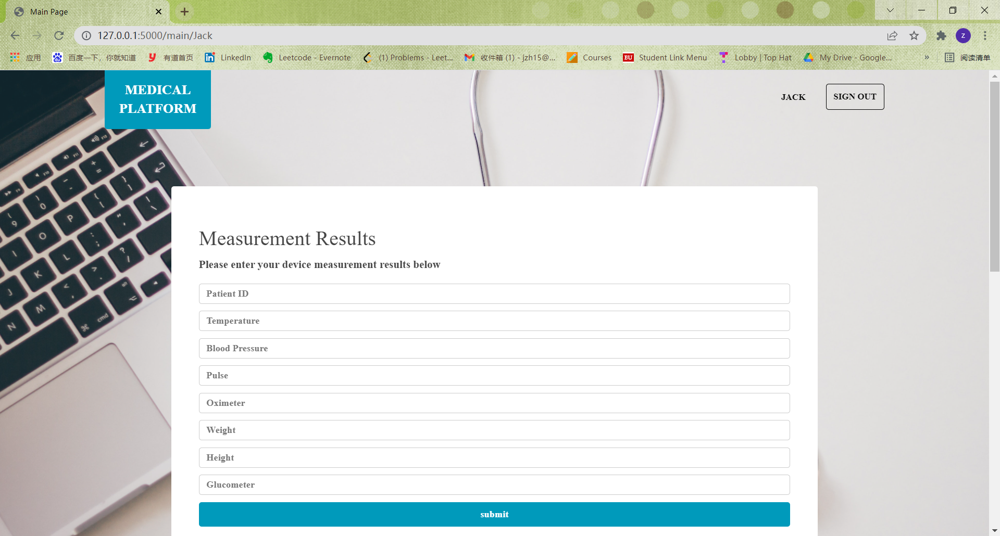

# Medical_Platform
Platform to monitor patients at home or in the hospitals 

## Branches
### Phase 0&1
All commits of phase 0 & 1 are in branch `Phase1` (now it's merged to `main` branch but not deleted).  
`Phase1` mainly achieves a device module, which uses json string of device measurement data as input and stores all data into a json file. In addition, this device module can handle error conditions, checking if measurement fields are missing and if measurement results are numbers and positive.

### Phase 2
All commits of phase 2 are in branch `Phase2` (now it's merged to `main` branch but not deleted).  
`Phase2` mainly achieves a restful system. Based on module in `Phase1`, it makes it restful which allows users to send device measurement results in json format. Then the restful system will parse the results in json format and pass into device module, checking fields and data errors and storing them in json file. The restful system is also deployed to AWS.

### Phase 3
All commits of phase 3 are in branch `Phase3` (now it's merged to `main` branch but not deleted).  
`Phase3` achieves chat module and corresponding restful api. In chat module it can send text/video/voice messages to other user. The text messages are directly stored in MySQL database while the addresses of video/voice files are stored in the database. A chat table is built for users (You can find its schema in [Database Schema](#database-schema)). As different users are needed in chat module, I also developed login/register functionality in restful api for the convenience of chat module testing. The user information and password are stored in user table.  

### Phase 4 (Project 5)
All commits of phase 4 are in branch `Phase4` (now it's merged to `main` branch but not deleted).  
`Phase4` builds a web application based on restful apis developed in previous phases. It has a index page introducing the purpose of the website and links to login/signup pages. In login page, it supports using Google login so that users can use their Google accounts to log in the website. The website application also contains a main page supporting device and chat functionality, which calls restful device and chat module at the back side. I also builds a display page for users to display history messages with others.

Below are several screenshots of my website application till `Phase4`

#### Index Page

 

#### Signup and Login Page
 

#### Main Page
Upload large video/voice file may take some time, please be patient.

 

#### Display Message Page
Messages received will be displayed at the left side of the screen while messages sent will be displayed at the right side.


### Phase 5 (Final Project)
This phase is completed together with teammate evezhang@bu.edu

All commits of phase 5 are in branch `Phase5` (now it's merged to `main` branch but not deleted).  
`Phase 5` builds other functionality like calendar module and voice transcriber module on the basis of `Phase 4`.

## Modules
### Device Module
The units for measurement fields are listed following.
| Field  | Unit   |
|------  |---------|
|temperature| ℃|
|bloodpressure|mmHg|
|pulse| bpm|
|oximeter| %|
|weight| kg|
|height| cm|
|glucometer| mg/dL|

#### POST /device/create
##### Parameters
```
{
  "username": "Jack",
  "temperature": "36",
  "bloodpressure": "70/110",
  "pulse": "100",
  "oximeter": "90",
  "weight": "65",
  "height": "175",
  "glucometer": "100"
}
```

All fields are required. If any field is missing there will an error reported.

`username` is also required because not only patient can enter measurement results, but also MP can input data for them.
##### Responses
```
Operation Status String (Succeed or Fail)
```
#### PUT /device/update
##### Parameters
```
{
  "username": "Jack",
  "temperature": "36",
  "bloodpressure": "70/110",
  "pulse": "100",
  "oximeter": "90",
  "weight": "65",
  "height": "175",
  "glucometer": "100"
}
```

##### Responses
```
Operation Status String (Succeed or Fail)
```

#### GET /device/{username}
##### Parameters
```
username is required and already shown in the url. No need for input.
```
##### Responses
```
{
  "username": "Jack",
  "temperature": "36",
  "bloodpressure": "70/110",
  "pulse": "100",
  "oximeter": "90",
  "weight": "65",
  "height": "175",
  "glucometer": "100"
}
```


### Chat Module
#### User Story
As a medical professional (Nurse or Doctor), I want to write a text or upload video/voice message to a patient.  
As a patient, I want to write a text or upload video/voice message to medical professional.  
As a patient or MP, I want to search for keywords in messages and chats.  
As a patient or MP, I want to check the history of chats and corresponding sending time (displaying chats).

#### Design
I decide to use SQL database for chat module. Though columns in SQL are fixed compared to fields in document database, I'll use `TEXT` type to store messages. `TEXT` type can store anything entered as a string with no limit on length of string. Another reason for using SQL is that all other modules use SQL and user infomation are also stored in SQL database. It'll be quite complex to communicate between SQL and document if only chat module use document database.

#### POST /chat/create
##### Parameters
```
{
  "sender": "Jack",
  "recipient": "Mandy",
  "type": "TEXT/VIDEO/VOICE",
  "message": "<message_string>/<file_address>"
  "time": "current_time"
}
```

##### Responses
```
Operation Status String (Succeed or Fail)
```

#### GET /chat/{username}
##### Parameters
```
username is required and already shown in the url. No need for input.
```
##### Responses
An array of messages
```
[
  {
    "sender": "Jack",
    "recipient": "Mandy",
    "type": "TEXT/VIDEO/VOICE",
    "message": "<message_string>/<file_address>"
    "time": "current_time"
  }
]
```

# Database Schema
### User table
In my table I set username as primary key intead of user_id (It's easier for me to deal with later design). So every user has to enter a unique username when registered, even though they may have the same names.
| Field  | Type   |Null | Key | Default | Extra |
|------  |---------|-----| -----| -----|-----|
|username| varchar(40)   | NO | PRI| | |
|password |   varchar(40)     | NO| || |
|email|  varchar(40)  | YES | |NULL | |
|age |  varchar(10)    |  YES| | NULL| |
|gender |   varchar(10)  |  YES| |NULL | |
|dob |  varchar(40)    | YES | |NULL | |
|doctor |  varchar(40)    | YES | |NULL | foreign_key|
|nurse |  varchar(40)    | YES | |NULL | foreign_key|


### Role table
| Field  | Type   |Null | Key | Default | Extra |
|------  |---------|-----| -----| -----|-----|
| username  | varchar(40)   | NO |  | NULL |foreign_key|
| role | varchar(40)| YES | | NULL| |

### Device Measurement table
| Field  | Type   |Null | Key | Default | Extra |
|------  |---------|-----| -----| -----|-----|
| patient | varchar(40)   | NO |  | NULL | foreign_key|
| measurement_type | varchar(40)   | YES | | NULL| |
| result | varchar(40)   | YES | | NULL| |
|time |datetime| YES | | NULL | |

### Chat table
| Field  | Type   |Null | Key | Default | Extra |
|------  |---------|-----| -----| -----|-----|
| sender  | varchar(40)   | NO |  | NULL |foreign_key|
| recipient  | varchar(40)   | NO |  | NULL |foreign_key|
| message_type | varchar(10)   |NO  | | NULL| |
| content | text   | YES | | NULL| |
| status | varchar(10)   | YES | | NULL| |
|time | datetime| YES | | NULL | |
